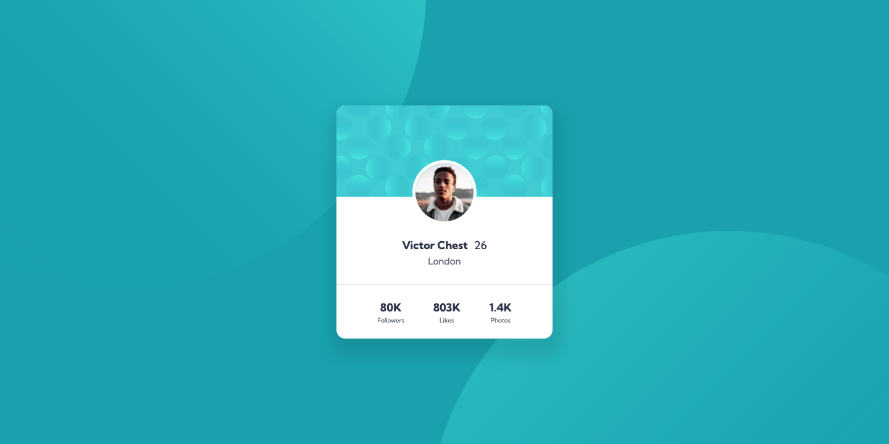

# Frontend Mentor - Profile card component solution

This is a solution to the [Profile card component challenge on Frontend Mentor](https://www.frontendmentor.io/challenges/profile-card-component-cfArpWshJ). Frontend Mentor challenges help you improve your coding skills by building realistic projects. 

## Table of contents

- [Overview](#overview)
  - [The challenge](#the-challenge)
  - [Screenshot](#screenshot)
  - [Links](#links)
- [My process](#my-process)
  - [Built with](#built-with)
  - [What I learned](#what-i-learned)
  - [Continued development](#continued-development)
- [Author](#author)

## Overview

### The challenge

- Build out the project to the designs provided

### Screenshot

### Links

- [Solution URL](https://github.com/dgatialy/fem-profile-card-component)
- [Live Site URL](https://suspicious-ride-6c61b3.netlify.app/)

## My process

### Built with

- Semantic HTML5 markup
- CSS custom properties
- Flexbox
- CSS Grid
- SCSS
- Parcel

### What I learned

- Shadows are difficult to recreate if there is no design.
- My solution for background graphics may not be optimal. Especially the responsive behavior. However, I haven't come up with something better yet.
- I recreated the designs in Figma and took them as a template for development. Nevertheless, it differs from the default designs (if you superimpose solution and design) 🧐🤷
- This time I didn't use "Fluid Spacings & Typography".

### Continued development

So far I have not tested my solution in other browsers except Firefox. 

## Author

- Frontend Mentor - [@dgatialy](https://www.frontendmentor.io/profile/dgatialy)
